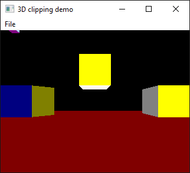

# gfx-blk-book

Capture some code from https://github.com/jagregory/abrash-black-book which is an ebook captured from [Michael Abrash's book](https://web.archive.org/web/20190706123029/http://www.drdobbs.com/parallel/graphics-programming-black-book/184404919) _"Black Book of Graphics Programming (Special Edition)"_ published in 1997.

Inspired to try this after reading

 - [GAME ENGINE BLACK BOOK: WOLFENSTEIN 3D, 2ND EDITION](https://fabiensanglard.net/gebbwolf3d/)
 - [GAME ENGINE BLACK BOOK DOOM](https://fabiensanglard.net/gebbdoom/)
 
 The author of those books was motivated by his own blog posts on related topics and Abrash's well-known books on assembly programming and PC graphics programming. 
 
Code listings in this repo are mostly from Part II of the book, including VGA Mode-X examples. They were tested (assembled/compile and executed) in a Dosbos-X environment. FreeDOS was also installed within this environment. Building and running of the examples worked succesfully on hosts running Windows 10, Windows 11, and macOS.  

Screenshot from Mode-X animation demo DOS app from Chapter 49

## Tools used

On host

 - DosBox-x
 - FreeDOS
 - Visual Studio Code
 
 For DOS development
 
  - Open Watcom C/C++ Version 1.9
  
  Open Watcom was used because it was easy to obtain via FreeDos package manager. Turns out that Abrash book was written for/tested on Borland C++/Turbo C++ and some code massaging would be needed here and there.
  
  For demo apps on windows:

  - Visual Studio 2022 Community Edition (Visual C++)

## Windows demo apps

Maze demo from CH60 CH62 DDJBSP2.zip

Clipping demo from CH65 DDJCLIP.zip

Enhanced clipping demo from CH67 DDJZSORT.zip

 ## Other Resources

 ...